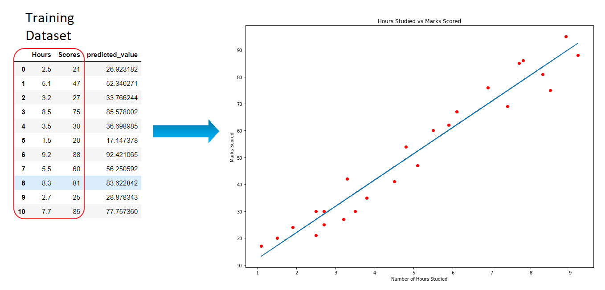

# Predicting student marks using Machine learning
 ### Project Level : Beginner
<li>To predict the marks a student scores based on the number of study hours. 

## Training Dataset : 
  <a href='https://github.com/AnalystSpot/Data-Science'>Student Score</a>
  
## Use :
  <li>Early prediction of students performance can help decision makers to provide the needed actions at the right moment, and to plan the appropriate training in order to improve the students success rate.

## Solution :
   <li>This is a Simple Linear task as it involves only 2 variables.
    
## Steps involved :
1. Import
2. Visualize
3. Model creation
4. Predict

     <h1 align='center'>Simple Linear Regression</h1>

<h2>Note : Fork the repository to review whenever you want.</h2>
